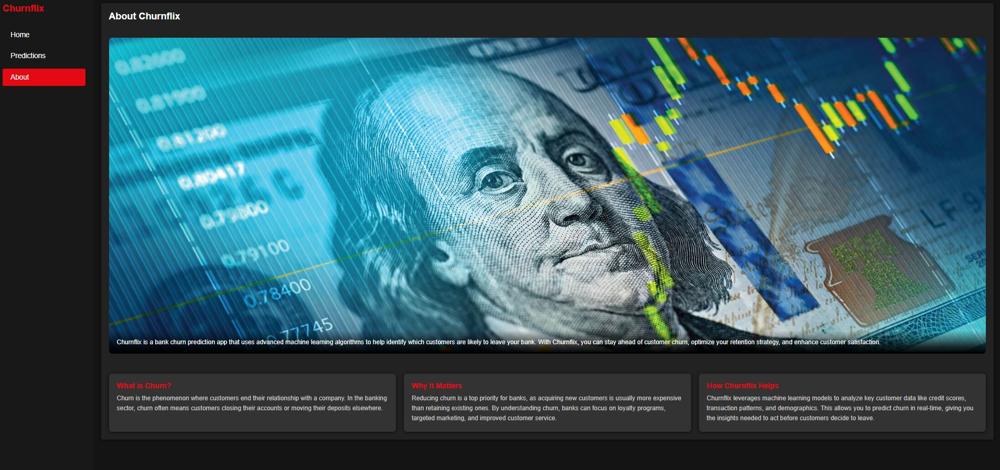
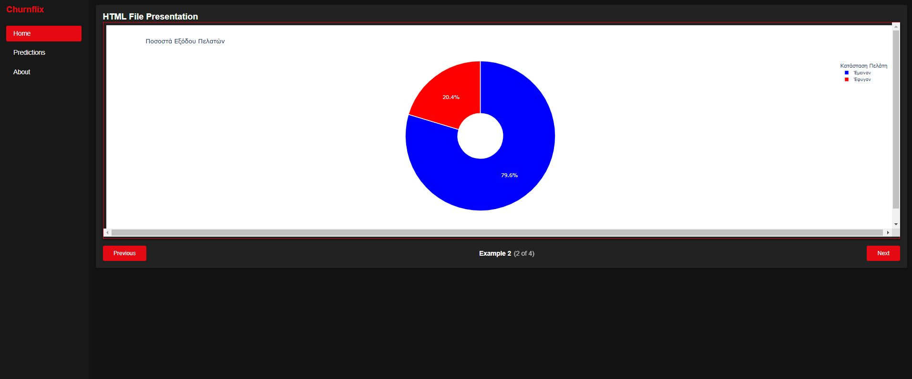
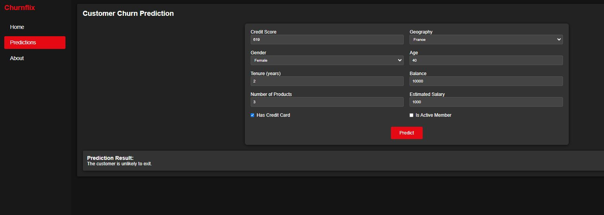

# 🚀 Bank Churn Prediction (Churnflix)

[](https://www.youtube.com/watch?v=sSKDmfddoZo)


## 📌 Overview

Churnflix is a **Netflix-inspired web application** designed to help banks predict **customer churn**. By analyzing financial and demographic data, the system provides **early warnings** about customers likely to leave, allowing banks to take **proactive measures** to retain them.

The system consists of:
✅ **A sleek React frontend** for user interaction\
✅ **A FastAPI backend** serving a machine learning model (XGBoost)\
✅ **Feature importance analysis using XGBoost** to explain key churn factors\
✅ **An Analytics Dashboard** for interactive customer insights

---

## **🖥️ Features**
- 🎬 **Netflix-style UI** – Clean, dark-themed interface for easy navigation.
- 📊 **AI-Powered Predictions** – Predict whether a customer is likely to leave.
- 📝 **Analytics Dashboard** – Explore churn trends with interactive visualizations.
- 🚀 **FastAPI Backend** – Efficient ML model deployment with a high-performance API.
- 🏗️ **Fully Containerized (Docker)** – Simple deployment using Docker Compose.

---

## 📸 **Screenshots**

### **1. About Page**


### **2. Analytics Page (NEW FEATURE 🎉)**


### **3. Predictions Page**


---

## **🛠 Tech Stack**
- **Frontend:** React (JavaScript) with a Netflix-style UI
- **Backend:** FastAPI (Python) for model inference
- **Machine Learning:** XGBoost for customer churn prediction
- **Data Processing:** Pandas, NumPy, scikit-learn
- **(Optional)** Docker & Docker Compose for containerized deployment

---

## **⚙️ How It Works**
1️⃣ **The user enters financial details** (e.g., Credit Score, Age, Balance).\
2️⃣ **The XGBoost model analyzes the data** and predicts whether the customer is likely to leave.\
3️⃣ **The system explains the decision**, showing which factors influenced the prediction the most.\
4️⃣ **Banks use this information** to retain at-risk customers through personalized offers and better service.

---

## **📈 Analytics Feature (NEW)**
### 🔥 **Explore Interactive Churn Trends**
The **Analytics Tab** allows users to visualize **churn distribution, demographics, and customer behaviors** with interactive **iframe-based plots**.

### **Key Insights from Data**
✅ **80% of customers stay, while 20% leave** – highlighting the need for better retention strategies.\
✅ **54% of customers are male, 46% are female** – gender distribution is fairly balanced.\
✅ **Customers aged 35-55 are more likely to leave**, whereas those aged 30-44 tend to stay.\
✅ **Customers with fewer bank products are more likely to churn**, suggesting stronger engagement strategies are needed.

---

## **🔬 Machine Learning Approach**
### **1️⃣ Data Processing**
✅ Cleaned and structured data for better model performance.\
✅ Identified and removed outliers.\
✅ Scaled numerical features and encoded categorical data.\
✅ Selected the **top 10 most important features** using feature selection techniques.

### **2️⃣ Model Training**
✅ Trained an **XGBoost classifier**, optimized for accuracy.\
✅ Used **Grid Search** to fine-tune hyperparameters.\
✅ Applied **SMOTE** to balance the dataset and avoid bias.

### **3️⃣ Explaining Predictions (Feature Importance)**
✅ **XGBoost’s Built-in Feature Importance** – ranks factors based on predictive power.\
✅ **Permutation Feature Importance** – measures how each feature affects model accuracy.\
✅ **Partial Dependence Plots (PDP)** – visualize how individual features impact churn predictions.

---

## **💻 Installation & Setup**
### **Prerequisites**
- **Node.js** (v14 or higher) for the frontend
- **Python 3.7+** and **pip** for the backend

### **Steps to Run the Project**
1️⃣ **Clone the repository**
```bash
git clone https://github.com/vasilis6194/Bank-Churn-Prediction-App.git

```
2️⃣ **Backend Setup (FastAPI)**

```bash
cd Backend
pip install -r requirements.txt
uvicorn main:app --reload
# Runs FastAPI at http://localhost:8000
```

3️⃣ **Frontend Setup (React)**

```bash
cd ../Frontend/my-react-app
npm install
npm start
# Runs React app at http://localhost:3000
```

4️⃣ **(Optional) Run with Docker**

```bash
docker-compose up --build -d
```

---

## 🏆 Final Deliverables

✅ **A fully functional web app** with live predictions.\
✅ **A trained XGBoost model** that provides high-accuracy churn forecasts.\
✅ **Data-driven insights** to help banks reduce churn.\
✅ **Explainability features** that allow banks to understand customer decisions.

---

## 👥 Project Contributors

- **Vangelis Diaskoufis**
- **George Birmpakos**
- **Kostas Kalentzis**
- **Vasilis Katsikas**

---

## 🚀 Conclusion

Churnflix **transforms raw data into actionable insights**, helping banks retain customers and **improve their services**. With AI-driven predictions and explainability tools, financial institutions can **make informed decisions** and **minimize customer churn**.

📊 **From data to strategy, Churnflix ensures that no customer leaves unnoticed.**

